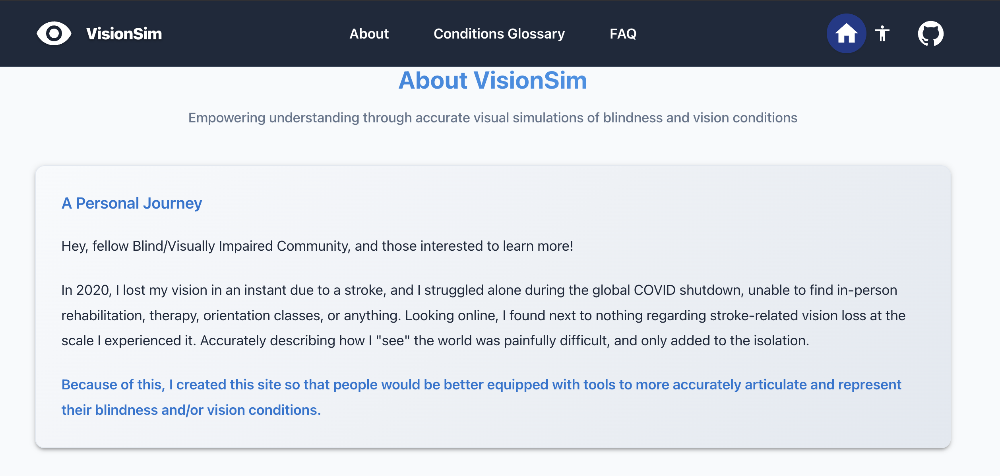
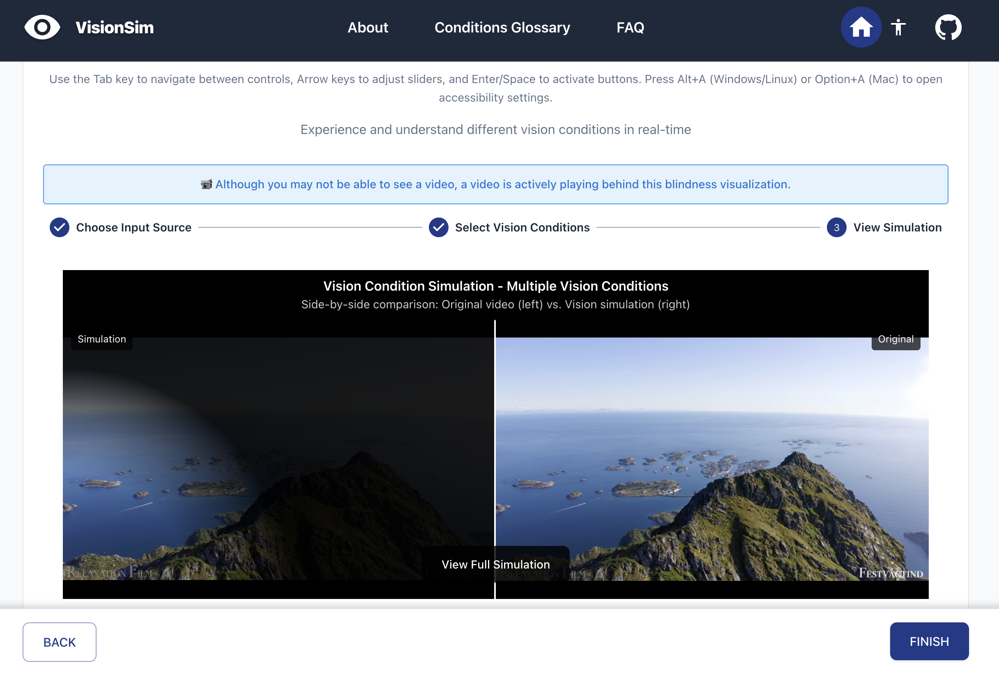
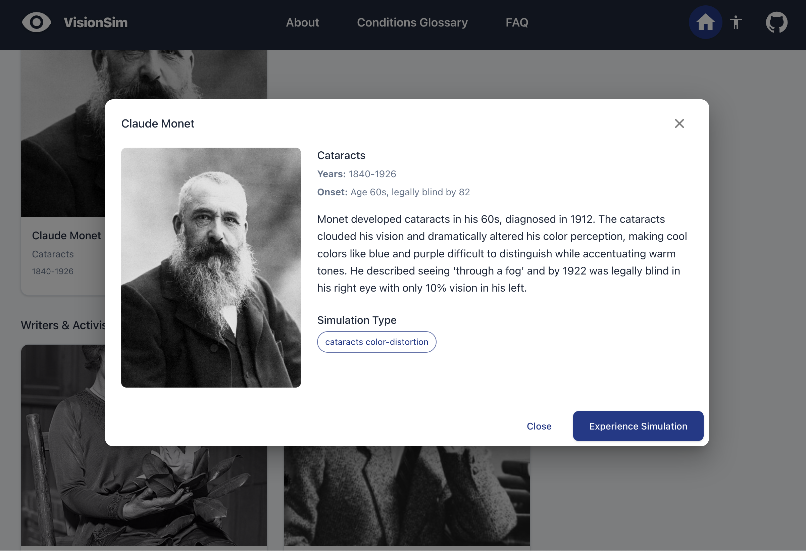

# Vision Condition Visualizer

[](https://www.bestpractices.dev/projects/12798)
[](https://github.com/bloo-berries/blindness-visualizer/actions/workflows/ci.yml)
[](https://github.com/bloo-berries/blindness-visualizer/actions/workflows/ci.yml)
[](https://github.com/bloo-berries/blindness-visualizer/actions/workflows/codeql.yml)
[](https://scorecard.dev/viewer/?uri=github.com/bloo-berries/blindness-visualizer)
[](https://opensource.org/licenses/MIT)
[](https://theblind.spot)
[](https://github.com/bloo-berries/blindness-visualizer/tree/main/src/locales)
[](https://www.typescriptlang.org/)
[](https://www.w3.org/WAI/WCAG21/quickref/)
[](https://pages.cloudflare.com/)
[](https://github.com/bloo-berries/blindness-visualizer/actions/workflows/dco.yml)
[](https://github.com/bloo-berries/blindness-visualizer/pulls)

**Live site: [theblind.spot](https://theblind.spot)**

A comprehensive web-based tool for visualizing various vision conditions and impairments. This tool helps create awareness and understanding of different visual conditions by simulating their effects on images and videos, while also educating users about famous blind and visually impaired individuals throughout history.

## Site Preview & Demo

### Homepage

https://github.com/user-attachments/assets/88988c3e-dc23-4d8d-82b8-d898a5cb3339

*Clean, modern interface with two main sections: Vision Condition Simulator and Famous People educational content*

### About Page



*Personal journey and mission statement explaining the tool's purpose and creator's experience*

## Features

### Vision Condition Simulator



- **Real-time visualization** of 148 vision conditions using a multi-layer rendering pipeline
- **Multiple input sources**:
  - Uploaded images
  - YouTube videos
- **Adjustable intensity** for each condition
- **Multi-layer rendering engine**:
  - WebGL shaders (Three.js) for color blindness matrix transformations
  - SVG filters for color vision effects
  - CSS filters for blur, contrast, and person-specific adjustments
  - DOM overlays for visual field loss, scotomas, and floaters
  - 20 animated JS-driven overlays for dynamic effects
- **Comprehensive condition library**:
  - Color blindness (Protanopia, Deuteranopia, Tritanopia, Achromatopsia, etc.)
  - Visual field defects (Hemianopia, Quadrantanopia, Scotoma, Tunnel Vision)
  - Eye conditions (Glaucoma, Cataracts, AMD, Diabetic Retinopathy, Keratoconus)
  - Neurological conditions (Visual Auras, Visual Snow, CBS Hallucinations)
  - Visual disturbances (Floaters, Blue Field Phenomenon, Palinopsia, Starbursting, PPVP)
  - Refractive errors (Nearsightedness, Farsightedness, Astigmatism, Diplopia)
  - Progressive conditions (Retinitis Pigmentosa, Stargardt Disease)

*Real-time vision condition simulation with multiple effects applied*

### Famous People Educational Section



- **214 famous individuals** across 8 categories:
  - Contemporary Figures (Christine Ha, Lucy Edwards, Molly Burke, Haben Girma, Mila Kunis, Dame Judi Dench, and more)
  - Athletes (Erik Weihenmayer, Marla Runyan, Anastasia Pagonis, Lex Gillette, and more)
  - Scientists & Medical Professionals (Dr. Mona Minkara, Joshua Miele, Abraham Nemeth, Leonhard Euler, and more)
  - Musicians (Ray Charles, Stevie Wonder, Andrea Bocelli, Blind Lemon Jefferson, Moondog, Rahsaan Roland Kirk, and more)
  - Artists (Claude Monet, Georgia O'Keeffe, John Bramblitt, Esref Armagan, and more)
  - Writers, Activists & Politicians (Helen Keller, Jorge Luis Borges, James Joyce, Taha Hussein, Chen Guangcheng, and more)
  - Historical Figures (John Milton, Louis Braille, Galileo Galilei, Harriet Tubman, Homer, Fanny Crosby, and more)
  - Fictional Characters (Daredevil, Geordi La Forge, Toph Beifong, Kenshi Takahashi, Fujitora, Julia Carpenter, Chirrut Imwe, and more)
- **Search and filter functionality** by name, condition, category, or country
- **Detailed person cards** with achievements, medical information, and life stories
- **Direct simulation integration** — experience each person's specific vision condition
- **Custom visualizations** for select individuals with unique visual experiences (37 person-specific effect files, 32 custom CSS filters, 18 custom DOM overlays, 20 animated overlays)
- **Embedded simulation preview** — live preview in each person's detail dialog

*Example of famous person profile with detailed information and simulation integration*

### Internationalization

- **26 languages** supported: Arabic, Bengali, Catalan, Chinese, Dutch, English, Finnish, French, German, Greek, Hindi, Icelandic, Irish, Italian, Japanese, Korean, Norwegian, Polish, Portuguese, Russian, Spanish, Swahili, Swedish, Turkish, Ukrainian, Vietnamese
- RTL support for Arabic
- Language preference persisted to localStorage

### Accessibility Features

- **Three theme modes**: Light, Dim (default), and Dark
- **Screen reader compatibility**
- **Keyboard navigation** support
- **High contrast mode**
- **Large text mode** with font size adjustments
- **Increased spacing mode**
- **Enhanced focus indicators** for better visibility
- **Reduced motion mode**

## Getting Started

### Prerequisites

- Node.js (version 18 or higher)
- npm

### Installation

```bash
# Clone the repository
git clone https://github.com/bloo-berries/blindness-visualizer.git

# Navigate to the project directory
cd blindness-visualizer

# Install dependencies
npm install

# Start the development server
npm start
```

The application will open at `http://localhost:3000`

## Usage

### Home Page

1. Visit the home page to see two main options:
   - **Vision Condition Simulator**: For real-time vision condition simulation
   - **Famous People**: To learn about famous blind and visually impaired individuals

### Vision Condition Simulator

1. **Choose Input Source**: Select image upload or YouTube video
2. **Select Conditions**: Toggle the vision conditions you want to simulate
3. **Adjust Intensity**: Use sliders to control the severity of each condition
4. **View Simulation**: Observe the real-time visualization

### Famous People Section

1. **Browse Categories**: Explore people by category (Historical, Musicians, Artists, etc.)
2. **Search & Filter**: Use the search bar or filters to find specific individuals by name, condition category, or country
3. **View Details**: Click on any person to see their achievements, detailed biography, and condition information
4. **Preview Simulation**: See a live simulation preview embedded in each person's detail dialog
5. **Experience Simulation**: Click "Experience Simulation" to try their specific vision condition in the full simulator

## Project Structure

```bash
src/
├── components/
│   ├── HomePage.tsx              # Landing page
│   ├── VisionSimulator.tsx       # Main simulator (2-step flow)
│   ├── FamousBlindPeople.tsx     # Famous people section
│   ├── FamousBlindPeople/        # Famous people sub-components
│   │   ├── PersonCard.tsx        # Individual person card
│   │   ├── PersonDialog.tsx      # Person detail modal
│   │   └── EmbeddedVisualization.tsx  # Live simulation preview
│   ├── Visualizer/
│   │   ├── Visualizer.tsx        # Real-time visualization engine
│   │   └── hooks/
│   │       ├── useMediaSetup.ts       # Input source initialization
│   │       ├── useEffectProcessor.ts  # Effect processing pipeline
│   │       ├── useAnimatedOverlay.ts  # 27 animated effect IDs
│   │       ├── useVisualFieldOverlay.ts # Field loss overlays
│   │       ├── useScreenshot.ts       # Screenshot capture
│   │       └── animatedOverlays/      # 20 animation generator files
│   ├── ControlPanel.tsx          # Condition selection controls
│   ├── InputSelector.tsx         # Input source selection
│   └── NavigationBar.tsx         # Site navigation
├── data/
│   ├── famousPeople/             # 214 people across 8 category files
│   │   ├── artists.ts
│   │   ├── athletes.ts
│   │   ├── contemporaryFigures.ts
│   │   ├── fictionalCharacters.ts
│   │   ├── historicalFigures.ts
│   │   ├── musicians.ts
│   │   ├── scientists.ts
│   │   ├── writersActivists.ts
│   │   └── types.ts
│   ├── effects/                  # Vision condition definitions
│   │   ├── colorVisionEffects.ts
│   │   ├── visualFieldEffects.ts
│   │   ├── visualDisturbanceEffects.ts
│   │   ├── retinalEffects.ts
│   │   ├── ocularEffects.ts
│   │   └── famousPeopleEffects/  # 37 person-specific effect files
│   └── visualEffects.ts          # Aggregates all effects
├── utils/
│   ├── shaders/                  # WebGL/GLSL shader system
│   ├── cssFilters/               # CSS filter pipeline
│   │   └── famousPeopleFilters/  # 32 person-specific filter files
│   ├── overlays/
│   │   └── famousPeople/         # 18 person-specific DOM overlays
│   └── famousPeopleUtils.tsx     # Person → simulation mapping
├── contexts/
│   └── AccessibilityContext.tsx   # Theme & accessibility state
├── i18n/
│   └── index.ts                  # 26-language i18n configuration
├── locales/                      # Translation JSON files
├── styles/
│   ├── App.css                   # Main styles + CSS variables
│   ├── Visualizer.css            # Visualization styles
│   └── Accessibility.css         # Accessibility feature styles
└── types/
    └── visualEffects.ts          # 148 ConditionType definitions
```

## Key Technologies

- **React 18** with TypeScript
- **Material-UI (MUI)** for UI components
- **Three.js** for WebGL shader-based visual effects
- **React Router** for SPA navigation
- **i18next** for internationalization (26 languages)
- **YouTube IFrame API** for video integration

## Development

### Available Scripts

```bash
npm start              # Start development server
npm run build          # Production build
npm run build:prod     # Production build without sourcemaps
npm run build:analyze  # Build with webpack bundle analyzer
npm test               # Run tests in watch mode
npm run clean          # Clear build artifacts and cache
npm run generate:llms  # Generate LLM data files
```

### Adding New Vision Conditions

1. Add the condition ID to the `ConditionType` union in `src/types/visualEffects.ts`
2. Create the effect definition in the appropriate `src/data/effects/*.ts` file
3. Implement the visual effect in the shader, CSS filter, or overlay system
4. If animated, add to `ANIMATED_EFFECTS` in `useAnimatedOverlay.ts` and create an animation file

### Adding New Famous People

1. Add person data to the appropriate file in `src/data/famousPeople/` (e.g., `musicians.ts`, `athletes.ts`)
2. Include required fields: `name`, `achievement`, `condition`, `years`, `onset`, `simulation`, `description`, `wikiUrl`, and `nationality`
3. Add their image to `public/images/people/`
4. Map their simulation key to effect IDs in `src/utils/famousPeopleUtils.tsx`
5. Optionally create custom effects, CSS filters, and/or animated overlays for unique visualizations

## Deployment

Deployed to **Cloudflare Pages** at [theblind.spot](https://theblind.spot). The GitHub repo is connected for automatic deployments on push to `main`.

## Contributing

We welcome contributions! Please see [CONTRIBUTING.md](CONTRIBUTING.md) for guidelines, including our **test policy** requiring tests for all new functionality.

## License

This project is licensed under the MIT License - see the [LICENSE](LICENSE) file for details.

## Support

If you encounter any issues or have questions:

- Open an issue on GitHub
- Check the existing issues for solutions
- Review the documentation in this README

---

**Note**: This tool is for educational and awareness purposes. It provides approximations of vision conditions and should not be used for medical diagnosis or treatment decisions.
