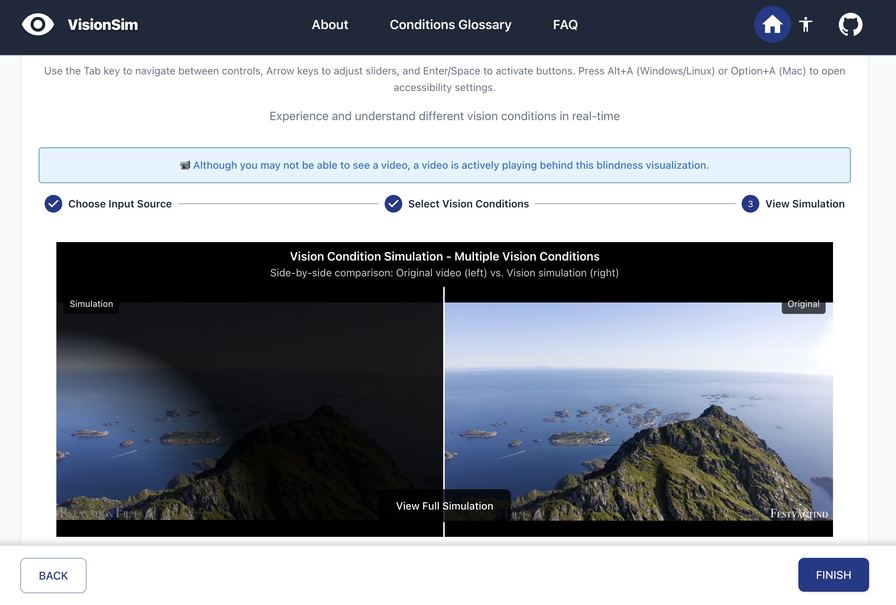
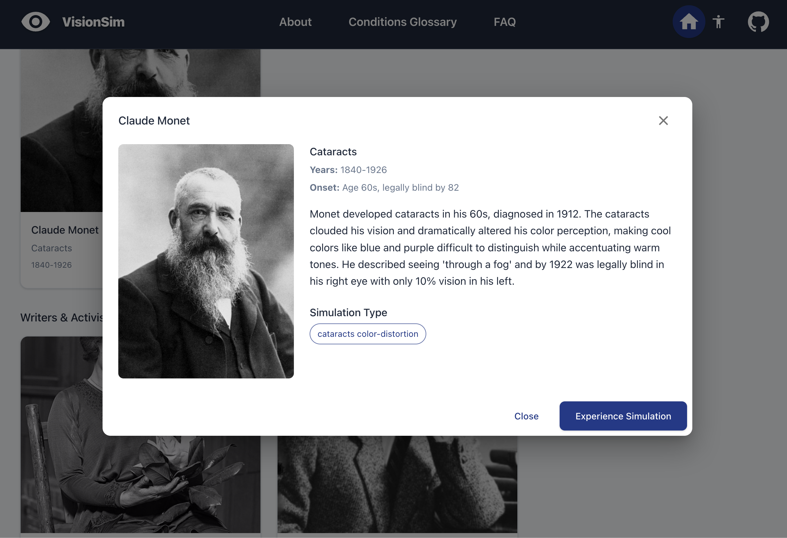

# Vision Condition Visualizer

A comprehensive web-based tool for visualizing various vision conditions and impairments. This tool helps create awareness and understanding of different visual conditions by simulating their effects on images and videos, while also educating users about famous blind and visually impaired individuals throughout history.

## Site Preview & Demo

### Homepage

https://github.com/user-attachments/assets/88988c3e-dc23-4d8d-82b8-d898a5cb3339

*Clean, modern interface with two main sections: Vision Condition Simulator and Famous People educational content*

### About Page


*Personal journey and mission statement explaining the tool's purpose and creator's experience*

## Features

### Vision Condition Simulator



- **Real-time visualization** of various vision conditions
- **Multiple input sources**:
  - Webcam feed
  - Uploaded images
  - YouTube videos
- **Adjustable intensity** for each condition
- **Comprehensive condition library**:
  - Color blindness (Protanopia, Deuteranopia, Tritanopia, etc.)
  - Visual field defects (Hemianopia, Quadrantanopia, Scotoma)
  - Eye conditions (Glaucoma, Cataracts, AMD, Diabetic Retinopathy)
  - Neurological conditions (Visual Auras, Visual Snow, Hallucinations)
  - Refractive errors (Nearsightedness, Farsightedness, Astigmatism)
  - Progressive conditions (Retinitis Pigmentosa, Stargardt Disease)

*Real-time vision condition simulation with multiple effects applied*

### Famous People Educational Section



- **125+ famous individuals** across 8 categories:
  - Historical Figures (John Milton, Louis Braille, Galileo Galilei, Harriet Tubman, Homer, Fanny Crosby, and more)
  - Musicians (Ray Charles, Stevie Wonder, Andrea Bocelli, Blind Lemon Jefferson, Moondog, Rahsaan Roland Kirk, and more)
  - Artists (Claude Monet, Georgia O'Keeffe, John Bramblitt, Esref Armagan, and more)
  - Writers & Activists (Helen Keller, Jorge Luis Borges, James Joyce, Taha Hussein, Chen Guangcheng, and more)
  - Contemporary Figures (Christine Ha, Lucy Edwards, Molly Burke, Haben Girma, Mila Kunis, Dame Judi Dench, and more)
  - Athletes (Erik Weihenmayer, Marla Runyan, Anastasia Pagonis, Lex Gillette, and more)
  - Scientists (Dr. Mona Minkara, Joshua Miele, Abraham Nemeth, Leonhard Euler, and more)
  - Fictional Characters (Daredevil, Geordi La Forge, Toph Beifong, Kenshi Takahashi, and more)
- **Search and filter functionality** by name, condition, category, or country
- **Detailed person cards** with achievements, medical information, and life stories
- **Direct simulation integration** - experience each person's specific vision condition
- **Custom visualizations** for select individuals with unique visual experiences

*Example of famous person profile with detailed information and simulation integration*

### Accessibility Features

- **Screen reader compatibility**
- **Keyboard navigation** support
- **High contrast mode**
- **Font size adjustments**
- **Focus indicators** for better visibility

## Getting Started

### Prerequisites

- Node.js (version 14 or higher)
- npm or yarn

### Installation

```bash
# Clone the repository
git clone https://github.com/bloo-berries/blindness-visualizer.git

# Navigate to the project directory
cd blindness-visualizer

# Install dependencies
npm install

# Start the development server
npm start
```

The application will open at `http://localhost:3000`

## Usage

### Home Page

1. Visit the home page to see two main options:
   - **Vision Condition Simulator**: For real-time vision condition simulation
   - **Famous People**: To learn about famous blind and visually impaired individuals

### Vision Condition Simulator

1. **Choose Input Source**: Select webcam, image upload, or YouTube video
2. **Select Conditions**: Toggle the vision conditions you want to simulate
3. **Adjust Intensity**: Use sliders to control the severity of each condition
4. **View Simulation**: Observe the real-time visualization

### Famous People Section

1. **Browse Categories**: Explore people by category (Historical, Musicians, Artists, etc.)
2. **Search & Filter**: Use the search bar or filters to find specific individuals by name, condition category, or country
3. **View Details**: Click on any person to see their achievements, detailed biography, and condition information
4. **Experience Simulation**: Click "Experience Simulation" to try their specific vision condition

## Project Structure

```bash
src/
├── components/
│   ├── HomePage.tsx              # Landing page with navigation options
│   ├── VisionSimulator.tsx       # Main simulator component
│   ├── FamousBlindPeople.tsx     # Famous people educational section
│   ├── FamousBlindPeople/        # Famous people sub-components
│   │   ├── PersonCard.tsx        # Individual person card display
│   │   └── PersonDialog.tsx      # Person detail modal
│   ├── Visualizer.tsx            # Real-time visualization engine
│   ├── ControlPanel.tsx          # Condition selection controls
│   ├── InputSelector.tsx         # Input source selection
│   ├── NavigationBar.tsx         # Site navigation
│   └── [other components]
├── data/
│   ├── famousPeople/             # Famous people data by category
│   │   ├── artists.ts
│   │   ├── athletes.ts
│   │   ├── contemporaryFigures.ts
│   │   ├── fictionalCharacters.ts
│   │   ├── historicalFigures.ts
│   │   ├── musicians.ts
│   │   ├── scientists.ts
│   │   ├── writersActivists.ts
│   │   └── types.ts              # PersonData type definition
│   └── effects/                  # Vision condition effects
├── contexts/
│   └── AccessibilityContext.tsx  # Accessibility state management
├── styles/
│   ├── App.css                   # Main application styles
│   ├── Visualizer.css            # Visualization-specific styles
│   └── Accessibility.css         # Accessibility feature styles
└── assets/
    └── images/
        └── people/               # Famous people images
```

## Key Technologies

- **React 18** with TypeScript
- **Material-UI (MUI)** for UI components
- **React Router** for navigation
- **Canvas API** for real-time image processing
- **WebRTC** for webcam integration
- **YouTube API** for video integration

## Development

### Available Scripts

```bash
# Start development server
npm start

# Build for production
npm run build

# Run tests
npm test

# Eject from Create React App
npm run eject
```

### Adding New Vision Conditions

1. Add the condition to the `effects` array in `VisionSimulator.tsx`
2. Implement the visual effect in the `Visualizer.tsx` component
3. Update the condition mapping in `FamousBlindPeople.tsx` if applicable

### Adding New Famous People

1. Add person data to the appropriate file in `src/data/famousPeople/` (e.g., `musicians.ts`, `athletes.ts`)
2. Include required fields: name, achievement, condition, years, onset, simulation, description, wikiUrl, and nationality
3. Add their image to `public/images/people/`
4. Add them to the appropriate category in `src/data/famousPeople/index.ts`

## Contributing

We welcome contributions! Here's how you can help:

1. **Fork the repository**
2. **Create a feature branch**: `git checkout -b feature/amazing-feature`
3. **Commit your changes**: `git commit -m 'Add amazing feature'`
4. **Push to the branch**: `git push origin feature/amazing-feature`
5. **Open a Pull Request**

### Areas for Contribution

- **New vision conditions**: Add more realistic simulations
- **Additional famous people**: Expand the educational content
- **Accessibility improvements**: Enhance screen reader support
- **Performance optimization**: Improve rendering speed
- **Mobile experience**: Enhance touch interactions
- **Documentation**: Improve guides and tutorials

## License

This project is licensed under the MIT License - see the [LICENSE](LICENSE) file for details.


## Support

If you encounter any issues or have questions:

- Open an issue on GitHub
- Check the existing issues for solutions
- Review the documentation in this README

---

**Note**: This tool is for educational and awareness purposes. It provides approximations of vision conditions and should not be used for medical diagnosis or treatment decisions.
